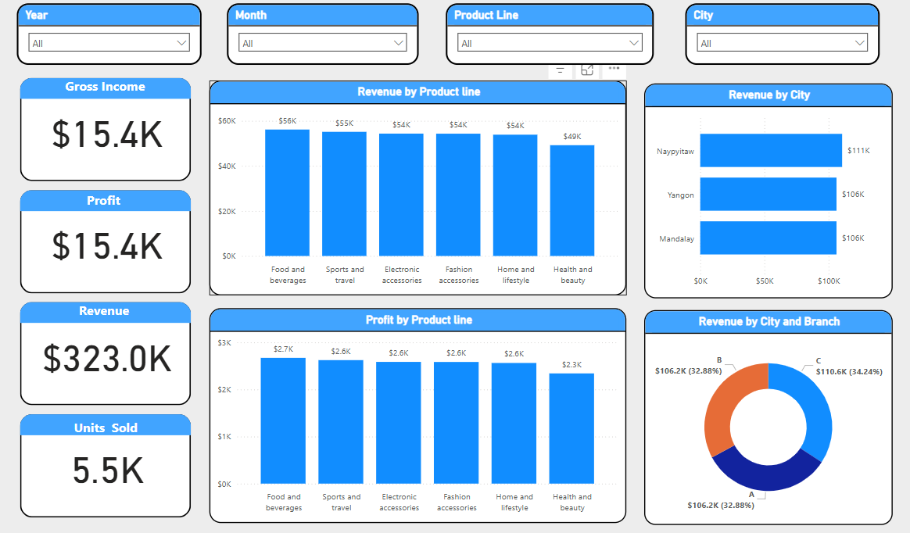

# Day_2

# *Sales Dashboard - Power BI*  

📊 *Interactive dashboard* analyzing revenue, profit, and sales performance by product, city, and branch.  

## *Key Features*  
✅ *KPIs:* Gross Income ($15.4K), Profit ($15.4K), Revenue ($323K)  
✅ *Filters:* Product line, city, branch  
✅ *Visuals:* Revenue by product, profit trends, regional sales  

📌 *Preview:*  
  

🔗 MIT License | [GitHub Profile](https://github.com/nawdevaibhav)
